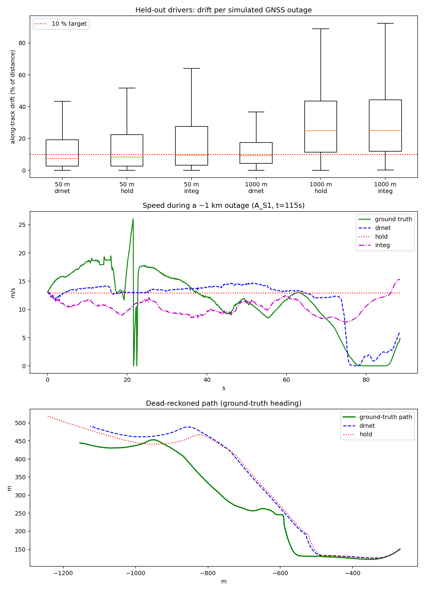

# Sense-Path: Technical Documentation

SensePath turns a smartphone into an Intelligent Dead Reckoning (IDR) navigator: while GNSS is good it
follows GNSS; when GNSS drops it keeps estimating speed and heading from the phone's accelerometer and
gyroscope with a small learned model, and returns to GNSS when it comes back. A second, headless engine
runs the same core on an external IMU stream.

> **Status in one paragraph.** The pipeline works end to end (trained model, Dart app, edge engine,
> scenario replay, real OSM roads), and the learned model clearly beats naive dead reckoning on drivers
> it never saw. It does **not** yet meet the PS target of <10 % drift reliably (about half of 1 km outages
> land within 10 %), position error is dominated by gyro heading drift, and nothing has yet been tested
> on a phone in a moving vehicle. Section 7 lists every limitation.

## 1. Architecture

```
phone IMU (accel incl. gravity, gyro) --50 Hz--> average to 10 Hz
GNSS fix (1 Hz, accuracy gated)
        |
        v
 FeatureStream            gravity estimate, gravity-aligned accel decomposition
 ForwardAxisCalibrator    learns the vehicle forward direction from GNSS speed changes
 YawAxisCalibrator        learns gyro -> heading-rate from GNSS bearing changes (mount independent)
        |  5 features: a_forward, a_lateral, a_vertical, heading rate, horizontal gyro norm
        v
 DRNet (GRU, 32 hidden, ONNX)   speed integrator seeded with the last GNSS speed
        |
        v
 IdrNav   heading = integrated gyro (+ZUPT bias), position = speed x heading; GNSS fixes reset it
```

* **Mode switching.** GNSS is declared lost after 1.5 s without a usable fix (accuracy worse than 50 m
  is ignored) or manually from the demo menu. On recovery the next GNSS fix overwrites position, heading
  and speed.
* **Calibration needs GNSS first.** The two axis calibrators need about 40 s of driving with GNSS before
  the app can dead-reckon; until then it holds the last GNSS speed. The HUD shows the calibration state.
* **Dart and Python are the same code.** `edge_engine/idr_core.py` + `idr_nav.py` are the reference;
  `lib/domain/dr_engine/idr_core.dart` + `idr_nav.dart` are a port, checked against golden vectors
  (`test/idr_core_test.dart`, generated by `tests/make_golden.py`). `tests/test_parity.py` checks the
  streaming core against the vectorised training features.

## 2. Data

IO-VNBD, 10 Hz phone IMU ("S" files) + vehicle logger ("V" files: speed, heading, position).
`ml_pipeline/prepare_runs.py` downloads (Git LFS) and merges runs into `data/runs/*.npz`.

Things we found that matter, because earlier versions of this repo got them wrong:

* **The rate is 10 Hz, not 100 Hz.** Ground-truth speed changes by a median 0.06 m/s per row, which is
  only plausible at 10 Hz. The old 100-sample "1-second" windows were really 10 s.
* **S and V files are not sample-synchronised.** The lag between the phone and the vehicle record varies
  by run (from <1 s to ~30 s). Each run is shifted by the lag at which the phone accelerometer best
  explains the vehicle's longitudinal acceleration (`features.imu_lag`).
* **The dataset's gyro axes are not in the accelerometer's frame.** Projecting gyro onto gravity gives
  almost no correlation with heading rate in the runs where turns can be measured; the second gyro column
  is the yaw axis (corr 0.5-0.6 in Driver A/B runs). This is why the yaw axis is *calibrated from GNSS*
  and not assumed.
* **Run selection.** Runs whose phone and vehicle records could not be aligned (A_S4, D_Y1, E_Vtb1) were
  excluded; B_M has a weak alignment fit (0.21) but is the largest run and is used for training.
* In the benchmark the vehicle logger's 1 Hz speed/bearing stands in for "GNSS" when calibrating the axes
  (the phone's own GPS column is not time-aligned in this dataset).

## 3. Model and training

`ml_pipeline/dr_net.py`: a GRU cell whose output is a bounded correction to the measured forward
acceleration plus a learned stop-gate; speed is integrated *inside* the network, so it is trained end to
end on 30 s outage-like sequences (`ml_pipeline/train_dr.py`) that start from the true speed, with
augmentation (forward-axis error up to 8 degrees, accelerometer bias). Loss: L1 on speed + integrated
distance error. 20 KB; exported with `ml_pipeline/export_dr_onnx.py` (checked against PyTorch over 300
chained steps, max difference 3e-5).

* Train: B_M, E_Vfa2, E_Vtb5. Validation / early stopping: E_Vfa1. **Test: Driver A (A_S1, A_S2), never
  touched during training or model selection** (an earlier model version was scored on it once; the final
  features/model were selected on validation only).
* Reproduce: `python ml_pipeline/prepare_runs.py && python ml_pipeline/train_dr.py --iters 3000 &&
  python ml_pipeline/export_dr_onnx.py && python ml_pipeline/benchmark_suite.py`.

## 4. Results (held-out Driver A, `ml_pipeline/benchmark_report.json`)

Every start point in the test runs is simulated as a GNSS outage that begins with the true speed and lasts
until the vehicle has travelled 50 m / 1 km. Drift = |integrated speed error| / distance travelled
(along-track). Position error integrates speed along either the true heading (isolates speed error) or
the gyro heading (what the app does, starting from the true heading).

| Outage | Method | Outages | Median drift | p95 drift | Within 10 % | Median position error (true heading) | Median position error (gyro heading) |
|---|---|---|---|---|---|---|---|
| 50 m | **SensePath DRNet** | 740 | 7.4 % | 53 % | 60 % | 4 m | 5 m |
| 50 m | Hold last GNSS speed | 740 | 8.4 % | 92 % | 56 % | 4 m | 5 m |
| 50 m | Integrate accelerometer only | 740 | 9.5 % | 115 % | 51 % | 5 m | 6 m |
| 50 m | (oracle: true speed) | 740 | 0.0 % | 0 % | 100 % | 0 m | 1 m |
| 1 km | **SensePath DRNet** | 482 | 9.4 % | 37 % | 53 % | 102 m | 279 m |
| 1 km | Hold last GNSS speed | 482 | 24.8 % | 77 % | 22 % | 197 m | 330 m |
| 1 km | Integrate accelerometer only | 482 | 25.0 % | 87 % | 22 % | 208 m | 337 m |
| 1 km | (oracle: true speed) | 482 | 0.0 % | 0 % | 100 % | 3 m | 227 m |



Reading it honestly:

* On 1 km outages the model more than halves the drift of naive dead reckoning (9.4 % vs 25 %), and 53 % of
  outages are within the 10 % target, but p95 is 37 %.
* On 50 m outages the gain is small (7.4 % vs 8.4 % median): short outages are dominated by noise.
* Ablation (1 km): zeroing the accelerometer features raises median drift from 12 % to 46 %, zeroing all
  features to ~98 %: the model really uses the IMU, not a speed prior.
* **Heading is the larger problem.** With the *true* speed and the gyro heading, the median 1 km position
  error is still 227 m. The target position error is not met.
* The ISRO example target "<5 m over 50 m" corresponds to 10 %; our median is 7.4 % but ~40 % of outages exceed it.

End-to-end check (`edge_engine`, one 90 s / 651 m outage in the demo scenario, Python and the macOS app
agree): 91 m final error (14 %). That is one window, not a statistic; use the table above.

## 5. App (Flutter)

* `lib/domain/dr_engine/`: `idr_core.dart`, `idr_nav.dart`, `onnx_runner.dart` (ONNX Runtime, one GRU step
  per 10 Hz tick), `map_matcher.dart`, and `dead_reckoning_engine.dart` (background isolate; sensors are
  averaged 50 Hz -> 10 Hz there; assets are loaded on the main isolate because `rootBundle` does not exist
  in a background isolate).
* `lib/data/sensors/sensor_service.dart`: accelerometer **with gravity**, gyroscope, GNSS (accuracy passed
  through).
* UI: flutter_map with the bundled OpenStreetMap road network (`assets/maps/road_network.json`, 838 ways,
  works offline), blue = position while GNSS is good, orange = dead-reckoned, green = reference path
  (scenario replay only). HUD shows speed, error vs reference (or distance driven if there is no
  reference), calibration state.
* **Judge Demo menu.** Replay the held-out drive with a 90 s outage (5x or 1x): raw phone IMU goes into the
  engine, fixes stop during the outage, the reference is used only to draw the green path and compute the
  HUD error. Manual GNSS-outage switch, recalibrate mount, data source (internal / edge engine).
* Map matching exists (`map_matcher.dart`, heading-gated nearest-road snap) but is **disabled**
  (`_enableMapMatching = false`): we have not shown it helps with gyro heading this poor. It is not HMM
  map matching.
* No covariance-tracking EKF: IdrNav is a complementary-filter style loop. Magnetometer is not used.

Verification done: `flutter analyze` clean; `flutter test` (Dart vs Python golden vectors); macOS debug
build; headless autoplay of the scenario on macOS (`flutter run -d macos --dart-define=AUTOPLAY_SCENARIO=true`)
runs the real ONNX model in the engine isolate (about 70 m error after ~600 m of dead reckoning).
**Not done: a run on a phone, and a real drive.**

## 6. Edge engine (external IMU, 200 Hz)

`edge_engine/`: FastAPI + WebSocket. `idr_core.py`/`idr_nav.py` run the AI step at 10 Hz; `edge_fusion.py`
adds a 200 Hz heading/position propagation layer between AI steps. `replay_streamer.py` replays the
held-out drive **interpolated from 10 Hz to 200 Hz** in place of a real FOG IMU: throughput and latency are
real (about 0.04 ms per AI step, ~90,000 ticks/s offline), accuracy is the same as the 10 Hz pipeline
(91 m / 14 % on the scenario), and the interpolated samples add no information. For a real 200 Hz IMU
construct `EdgeFusionEngine(average=True)` (box-averages 20 samples into each AI sample) and replace
`ReplaySource.tick` by a serial/UDP reader. There is no C++ implementation.

Run: `cd edge_engine && ./run_edge.sh`, then `/health`, `/dashboard`, `ws://HOST:8080/ws/telemetry?speed=N`.
`/health` reports measured rate and latency.

## 7. Limitations and next steps

1. **Not validated on a phone or a real drive.** Phone sensor conventions (axes, gravity in the
   accelerometer stream, GNSS accuracy/heading) are handled by calibration, but must be checked in a car.
2. **Meets the drift target only part of the time** (53 % of 1 km outages within 10 %); position error is
   dominated by heading.
3. **Heading:** gyro-only; no magnetometer or map-based correction. The best next step is heading aiding
   (magnetometer + road-heading constraint) and a real HMM map matcher.
4. **Data quality:** unsynchronised S/V files, only three training runs, one held-out driver. More runs
   and a phone-recorded set would help most.
5. Calibration needs ~40 s of GNSS driving; the phone's real GNSS latency is not modelled.
6. Edge engine uses a replay, not a physical FOG; no C++ port.
7. The earlier presentation mentions TFLite, PostgreSQL and a CNN-GRU speed regressor: the shipped system
   uses ONNX, no database, and the recurrent speed integrator above.
